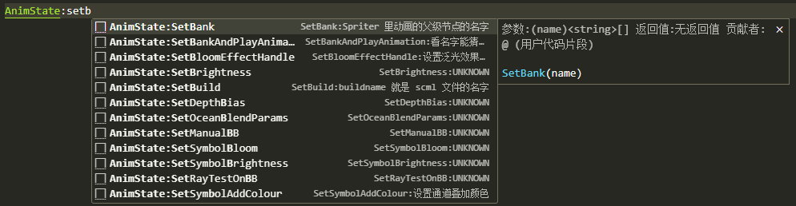

# dst-api 

Don't Starve Together API Complete for VSCode

---

**插件下载**: 请于VSCode的插件市场中搜索关键字: **dst**

特别感谢月佬的分享!

edited by lan

ps: 由于都是批量处理,难免会有些问题,可以向我反馈

gitee:
https://gitee.com/b1inkie/dst-api

## 成为贡献者:

*`scripts/`* 目录下,存放着所有需要进行注释的lua文件!

1. `scripts/components` 中,可以看到用lua的表形式创建的*组件方法表*

让我们来看一个例子:
`scripts/components/finiteuses.lua`
这是耐久度组件的其中一个方法:
```lua
    ["SetConsumption"] = { -- 方法名:已自动生成,请勿改动
        params = {
            -- param: 参数名(自动生成) explain: 参数说明(万能的群友们,请帮我注释吧)
            -- type: 参数类型<nil|boolean|number|string|function|thread|table|any>
            ---------------<空值|  布尔  | 数值 | 字符串 |  函数  | 线程 |  表  |不定>
            {param = "action", explain = "动作id", type = "any"}, 
            {param = "uses", explain = "剩余使用次数", type = "number"},

        },
        returns = {
            -- 此处填返回值,如果无返回值,请留空
            -- 返回格式 explain: 参数说明(万能的群友们,请帮我注释吧) type: 参数类型
            -- {explain = "", type = ""}
        },
        tips = "设置对应动作的消耗次数", -- 简明扼要的说明方法的用途
        author = "lan", -- 贡献者id (填上您的名字,作为贡献者,你的名字会出现在补全提示中)
    },
```

补全预览(只要注释够详细,补全能当文档用):




登不上github? 看下图:
直接键入 `contri+components` 生成注释模板,注释好后丢给我即可.(加我的小群,或者大群 *@我* 都可以)


2. 系统组件:Animstate `scripts/system_components/AnimState.lua`

## 已有的补全:

1. 所有components组件方法补全(不含注释)
2. physics补全
3. Image类补全
...
0. 常用api补全

## Todo:

1. 快捷输入RGB颜色值(0~1)
例如 输入color.red 自动补全为 1,0,0

0. 创建一个git仓库 方便集思广益

*Q群*:

五年一班: 620984175

龙飞群: 559477977 (入群口令 LongFei_Gamer)

我的代码交流小群(勿灌水): 855512521

