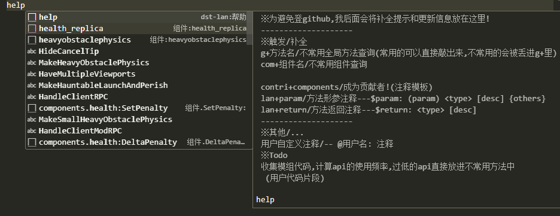
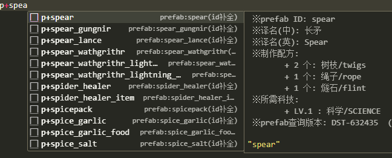
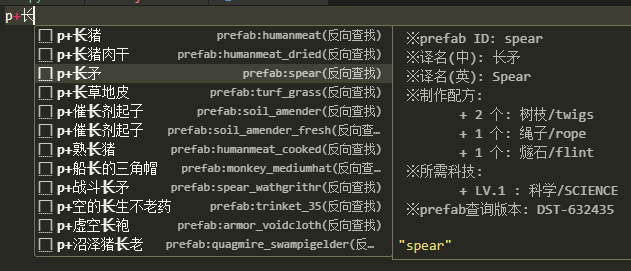
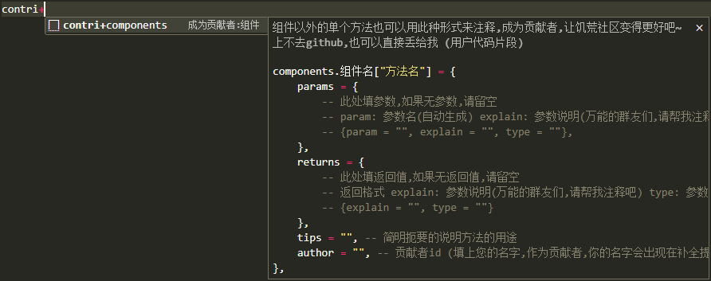
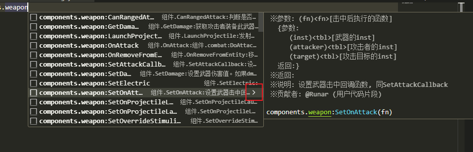
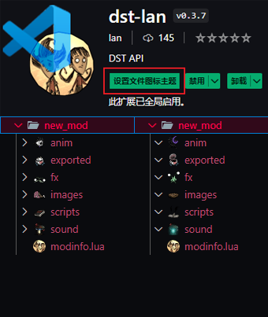

# Don't Starve Together API Complete Extension For VSCode


---

## 🎮插件下载

- 在 **`VSCode`** 的 **`插件市场`** 中搜索关键字  **`dst-lan`** 即可找到并安装本插件。

## 版本兼容性

- 同步 "Don't Starve Together" 版本 619045。

## 项目地址(注释项目)

- Git: https://github.com/b1inkie/dst-api

## 📖help(重要)

安装插件后,直接键入`help`,点击提示框中的`help`补全的右尖括号,将可以看到详细信息:



### 💊特殊

`p+预制物id` -> `预制物id补全,可以输中文译名查找` 隔段时间会更新





`g+方法名` -> `不常用全局方法查询(常用的可以直接敲出来,不常用的会被丢进g+里)` 开发中...
`正常触发方法+i` -> `启发模式:提供一些快捷代码块` 开发中...


## 😎成为贡献者

### 💖lan的话:
注释模板的语法已修改成`lua`,方便大家补充.
当然,如果您有任何形式的注释文档(尽量有一定格式的,最好能用`正则`处理的),也可以直接丢给我,我会加以处理并整合到插件中,我会在`贡献者`中附上 **`您的名字`**

### 目录结构

`scripts`目录中存放所有需要注释的 `Lua` 文件

- `scripts/`: 全局方法,常用词汇等
  - `scripts/components/`: 组件
  - `scripts/system_components/`: 系统组件

### 示例
#### 组件方法示例

```lua
    ["SetConsumption"] = { -- 方法名:已自动生成,请勿改动
        params = {
            -- param: 参数名(自动生成) explain: 参数说明(万能的群友们,请帮我注释吧)
            -- type: 参数类型(括号中为简写)  
            -- <nil|boolean(bool)|number(num)|string(str)|function(fn)|thread|table(tbl)|any|>
            -- <空值|     布尔    |    数值    |   字符串   |    函数    |  线程  |    表    |不定|>
            -- type: 专有参数类型(括号中为简写)
            -- <entity(ent)|Vector3(V3)>
            -- <    实体   |  三维向量  >
            -- 参数类型详细说明 -- 空值 nil: 个别参数为nil, 方法仍有意义时需要添加; 
            ------------------- 实体 (entity|ent): 表, 但特指预制物
            ------------------- 三维向量 (Vector3|V3): 元素键名为x,y,z的表
            ------------------- 可变参数: param = "..." 的参数, 建议使用 "any|nil" 作为type
            {param = "action", explain = "动作id", type = "any"}, 
            {param = "uses", explain = "剩余使用次数", type = "number"},

        },
        returns = {
            -- 此处填返回值,如果无返回值,请留空
            -- 返回格式 explain: 参数说明(万能的群友们,请帮我注释吧) type: 参数类型
            -- {explain = "", type = ""}
        },
        tips = "设置对应动作的消耗次数", -- 简明扼要的说明方法的用途
        author = "lan", -- 贡献者id (填上您的名字,作为贡献者,你的名字会出现在补全提示中)
    },
```

#### 带函数参数的方法示例

```lua
    -- 参数为函数的参数写法
    ["SetOnAttack"] = {
        params = {
            {
                param = "fn", explain = "击中后执行的函数", type = "function", -- 当type中含有function时
                -- 函数参数的参数
                fn_params = { -- 除了键名不同，写法与父表一致
                    {param = "inst", explain = "武器的inst", type = "entity"},
                    {param = "attacker", explain = "攻击者的inst", type = "entity"},
                    {param = "target", explain = "攻击目标的inst", type = "entity"},
                },
                -- 函数参数的返回值,没有请留白
                fn_returns = {
                    -- {explain = "", type = ""},
                }
            },

        },
        returns = {
            -- {explain = "", type = ""}
        },
        tips = "设置武器击中回调函数, 同SetAttackCallback",
        author = "Runar",
    },
```

#### github抽风了?

看下图:
直接键入 `contri+components` 生成注释模板,注释好后丢给我即可.(加我的小群,或者大群 *@我* 都可以)




## 🎬补全预览:

(只要注释够详细,补全能当文档用)




## ✨Extra:

- Lua 语法高亮:

- 自动生成注释模板(注意本功能是基于monokai主题的配色,其他主题可能视觉效果不佳):

    + 键入: `lan+param`
    <span style="color: #88846f;">---</span><span style="color: #52d9ce;">\$</span><span style="color: #f92749;">param</span><span style="color: #52d9ce;">:</span> <span style="color: #f1d70b;">(</span><span style="color: #fd8921;">param</span><span style="color: #f1d70b;">)</span> <span style="color: #ae81ff;"><</span><span style="color: #66d9ef;">type</span><span style="color: #ae81ff;">></span> <span style="color: #88846f;">[</span><span style="color: #e6db74;">desc</span><span style="color: #88846f;">]</span> {others}
    + 键入: `lan+return`
    <span style="color: #88846f;">---</span><span style="color: #52d9ce;">\$</span><span style="color: #f92749;">return</span><span style="color: #52d9ce;">:</span>  <span style="color: #ae81ff;"><</span><span style="color: #66d9ef;">type</span><span style="color: #ae81ff;">></span> <span style="color: #88846f;">[</span><span style="color: #e6db74;">desc</span><span style="color: #88846f;">]</span>

- 新增用户注释模板:
    + <span style="color: #88846f;">--</span> <span style="color: #52d9ce;">@</span><span style="color: #8ae22e;">V2C</span>: <span style="color: #88846f;">wat's this?</span>

- mod目录特别图标:
    + 安装后,点击 `设置文件图标主题` 选择 `DST LAN ICON` 主题
    


## 📝Todo:

1. 快捷输入RGB颜色值(0~1)
    例如 输入color.red 自动补全为 1,0,0

2. 统计API频率

## 🏡社区:

- *Q群*:
    + 五年一班: 620984175
    + 龙飞群: 559477977 (入群口令 LongFei_Gamer)
    + 我的代码交流小群(勿灌水): 855512521

## 🚩Contributors

- 创建者
    + lan 

- 协作
    + Runar

- 其他贡献者
 

