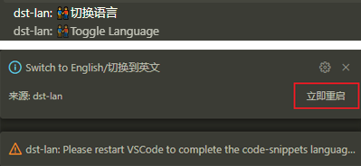

# Don't Starve Together API Complete Extension For VSCode


## 🎮插件下载/Extension Download

- 在 **`VSCode`** 的 **`插件市场`** 中搜索关键字  **`dst-lan`** 即可找到并安装本插件。
- To find and install this Extension, search keyword **`dst-lan`** in the **`VSCode Extension Marketplace`**.

- 不再支持 `1.73.0` 以下版本的 `VSCode`
- No longer supports `VSCode` versions below `1.73.0`

## 👁‍🗨版本兼容性/Version Compatibility

- 同步 "Don't Starve Together" 版本 `619045` 。
- Synchronized with "Don't Starve Together" version `619045` .

## 🗼注释项目地址/Comment Project URL

- Git: https://github.com/b1inkie/dst-api

## 📖help

- 安装插件后,直接键入`help?`(为了不污染全局补全环境,像是help之类的hint,需要用特殊符号触发):
- After installing the plugin, type `help?`(To avoid polluting the global autocompletion environment, hints like help need to be triggered with special characters.):


### 💊糖/suger

- `p+预制物ID` -> `预制物id补全,可以输中文译名查找` (隔段时间会更新)
- `p+prefabID` -> `Prefab ID completion, can search by translated name` (Updated periodically)

- `g+方法名` -> `不常用全局方法查询(常用的可以直接敲出来,不常用的会被丢进g+里)` (开发中...)
- `g+method` -> `Less Frequently Used Global Method Lookup (Commonly used methods can be typed directly; less common ones are included here)` (WIP)

- `正常触发方法+i` -> `启发模式:提供一些快捷代码块` (开发中...)
- `Normal Trigger Method+i` -> `Inspiration Mode: Provides some quick code snippets` (WIP)

## 😎成为贡献者/Become a Contributor

### 💖lan的话:/tips from lan:

- 注释模板的语法已修改成`lua`,方便大家补充.
- The syntax of the comment template has been modified to `lua` for easier contribution.


- 当然,如果您有任何形式的注释文档(尽量有一定格式的,最好能用`正则`处理的),也可以直接丢给我,我会加以处理并整合到插件中,我会在`贡献者`中附上 **`您的名字`**
- Of course, if you have any form of comment documentation (preferably with a certain format, ideally processable with `regex`), you can also send it to me. I will process and integrate it into the plugin, and I will include **`your name`** in the `Contributors` list.

### 🧮目录结构/Directory Structure

#### 中文:

```txt
scripts_cn
├── components-组件
│   └── ...-所有组件
├── system_components-系统组件
│   ├── AnimState-动画
│   ├── Transform-形态
│   ├── Physics-物理
│   └── SoundEmitter-音效
├── constant-常量
├── entityscript-实体方法
├── global_fn_maybe-可能的全局方法
├── method_custom-找不到归宿的方法
├── tags-标签
├── var_name_components-组件名翻译
├── var_name_dst-饥荒词汇翻译
└── var_name_custom-自定义词汇
```

#### English:

```txt
scripts_en
├── components-Component
│   └── ...-All Components
├── system_components-System Components
│   ├── AnimState-Animation
│   ├── Transform-Transform
│   ├── Physics-Physics
│   └── SoundEmitter-Sound
├── constant-Constant
├── entityscript-Inst Method
├── global_fn_maybe-Possible GLOBAL Methods
├── method_custom-Can not find the parent
├── tags-Tag
├── var_name_components-Component Name Translate
├── var_name_dst-DST Vocabulary Translate
└── var_name_custom-Custom Vocabulary
```

### 🎈如何贡献/How to Contribute

- `scripts_cn` 下放着所有要注释的文件,写好后, `pull request` 即可.
- All files to be commented are placed under `scripts_en`. After you have written the comments, submit a `pull request`.

- 🪁注目: 由于 `scripts_en` 是从 `scripts_cn` 拷贝过来的, 所以包含了大量中文,如果您发现了中文部分,您可以删除,也可以修改为英文. 相反的,如果 `scripts_cn` 中您发现了大量英语内容,也可以将其翻译成中文.
- 🪁Note: Since `scripts_en` is copied from `scripts_cn`, it contains a lot of Chinese text. If you find any Chinese content, you can delete it or translate it into English. Conversely, if you find a lot of English content in `scripts_cn` , you can translate it into Chinese.

### 💡格式/Format 

```lua
-- 中文
["SetCollisionCallback"] = { -- 方法名,已自动生成
    ["params"] = { -- 参数
        [1] = { -- 第几个参数
            ["param"] = "fn", -- 参数名称
            -- <nil|boolean(bool)|number(num)|string(str)|function(fn)|thread|table(tbl)|any|>
            -- <空值|     布尔    |    数值    |   字符串   |    函数    |  线程  |    表    |不定|>

            -- <entity(ent)|Vector3(V3)>
            -- <    实体   |  三维向量  >
            ["type"] = "fn", -- 参数类型
            ["explain"] = "", -- 参数简述
            ["fn_params"] = { -- 当参数是函数时,添加这一项
                [1] = {
                    ["type"] = "ent",
                    ["param"] = "inst",
                    ["explain"] = "碰撞者自己"
                },
                [2] = {
                    ["type"] = "ent",
                    ["param"] = "other",
                    ["explain"] = "被碰撞者"
                },
            },
            ["fn_returns"] = { -- 函数参数的返回值,没有请留白
                -- [1] = {explain = "", type = ""},
            },
        },
    },
    ["returns"] = { -- 返回
        -- [1] = {explain = "", type = ""},
    },
    ["author"] = "", -- 您的名字(作为贡献者,您的名字会出现在补全提示中)
    ["tips"] = "", -- 简述这个方法的作用
    -----------------------------------------
    --下面为特殊项(如果您不清楚语法,请勿添加) --
    -----------------------------------------
    ["replace_body"] = "", -- 这一项将直接替换补全的主体部分
    ["inspire"] = { -- 启发模式:这一项不会影响原有的补全,而是新增一条补全,用+i来触发
		["tips"] = "", -- 启发模式的代码块简述
		["body"] = "", -- 启发模式的主体部分
	},
},
```

```lua
-- English Ver
["SetCollisionCallback"] = { -- Method name, auto-generated
    ["params"] = { -- Parameters
        [1] = { -- Parameter index
            ["param"] = "fn", -- Parameter name
            -- <nil|boolean(bool)|number(num)|string(str)|function(fn)|thread|table(tbl)|any|>

            -- <entity(ent)|Vector3(V3)>
            ["type"] = "fn", -- Parameter type
            ["explain"] = "", -- Parameter description
            ["fn_params"] = { -- When the parameter is a function, add this item
                [1] = {
                    ["type"] = "ent",
                    ["param"] = "inst",
                    ["explain"] = "The colliding entity itself"
                },
                [2] = {
                    ["type"] = "ent",
                    ["param"] = "other",
                    ["explain"] = "The entity being collided with"
                },
            },
            ["fn_returns"] = { -- Return values of the function parameter, leave blank if none
                -- [1] = {explain = "", type = ""},
            },
        },
    },
    ["returns"] = { -- Returns
        -- [1] = {explain = "", type = ""},
    },
    ["author"] = "", -- Your name (as a contributor, your name will appear in the completion prompt)
    ["tips"] = "", -- Brief description of what this method does
    -------------------------------------------------------------------
    -- special items (do not add if you are unsure about the syntax) --
    -------------------------------------------------------------------
    ["replace_body"] = "", -- This item will directly replace the completion body
    ["inspire"] = { -- Inspiration mode: this item will not affect the original completion but adds a new one triggered by +i
		["tips"] = "", -- Description of the inspiration mode code snippet
		["body"] = "", -- Body of the inspiration mode
	},
},
```

## 🎬补全预览:/Completion Preview:


## 🥢切换到中文/🍴Switch To English

`ctrl + shift + p` -> `dst-lan: toggle language`
切换语言后,请务必点击重启/After switching the language, please make sure to click Restart.



## ✨Extra:

- Lua 语法高亮/Lua Syntax Highlighting:

- 自动生成注释模板/Comment Template:
    + `LAN+param`
    <span style="color: #88846f;">---</span><span style="color: #52d9ce;">\$</span><span style="color: #f92749;">param</span><span style="color: #52d9ce;">:</span> <span style="color: #f1d70b;">(</span><span style="color: #fd8921;">param</span><span style="color: #f1d70b;">)</span> <span style="color: #ae81ff;"><</span><span style="color: #66d9ef;">type</span><span style="color: #ae81ff;">></span> <span style="color: #88846f;">[</span><span style="color: #e6db74;">desc</span><span style="color: #88846f;">]</span> {others}
    + `LAN+return`
    <span style="color: #88846f;">---</span><span style="color: #52d9ce;">\$</span><span style="color: #f92749;">return</span><span style="color: #52d9ce;">:</span>  <span style="color: #ae81ff;"><</span><span style="color: #66d9ef;">type</span><span style="color: #ae81ff;">></span> <span style="color: #88846f;">[</span><span style="color: #e6db74;">desc</span><span style="color: #88846f;">]</span>

- 用户注释模板/Modder Comment Template:
    + <span style="color: #88846f;">--</span> <span style="color: #52d9ce;">@</span><span style="color: #8ae22e;">V2C</span>: <span style="color: #88846f;">wat's this?</span>

- mod目录特别图标/Special Icon for mod Directory:
    + 安装后,点击 `设置文件图标主题` 选择 `DST LAN ICON` 主题/After installation, click on `Set File Icon Theme` and choose the `DST LAN ICON` theme

    

- 命令:执行打包/Command:Run Compiler
    + `ctrl + shift + p` -> `dst-lan.compiler`
    + 选择: 配置打包工具中scml.exe路径/Select: Settings DST modtools compiler scml.exe Path
    + 选择: 运行打包即可/Select: Run compiler

- 命令: 制作预制物动画和图片/Command: Make Prefab Anim and Img
    + `ctrl + shift + p` -> `dst-lan.makeimg`
    + 选择: 提取图片到_temp文件夹/Select: Extracting images to the _temp folder
    + 选择: 我已制作好了_temp中的图片!/Select: finished making the images in _temp!
    + 完成后`执行打包`即可/After that, you can `Run compiler`

## 📝Todo:

## 🏡社区:

- *插件Q群*:
    + 饥荒mod制作交流及插件建议,贡献,问题反馈群(刚创的): 623398781

- *其他推荐Q群*:
    + 五年一班: 620984175
    + 龙飞群: 559477977 (入群口令 LongFei_Gamer)
    + 饥荒mod制作群: 557963863
    

## 🚩贡献者/Contributors

- 创建者/Owner
    + lan 

- 协作/Collaborators
    + Runar

- 其他贡献者/Others
    + 卡得粉丝